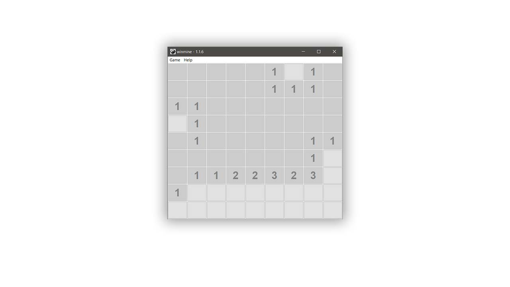
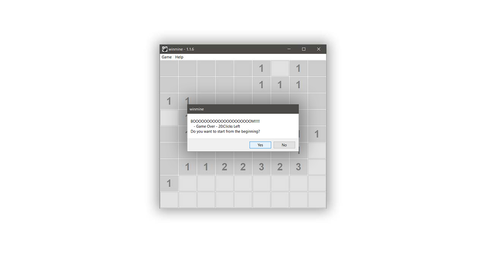
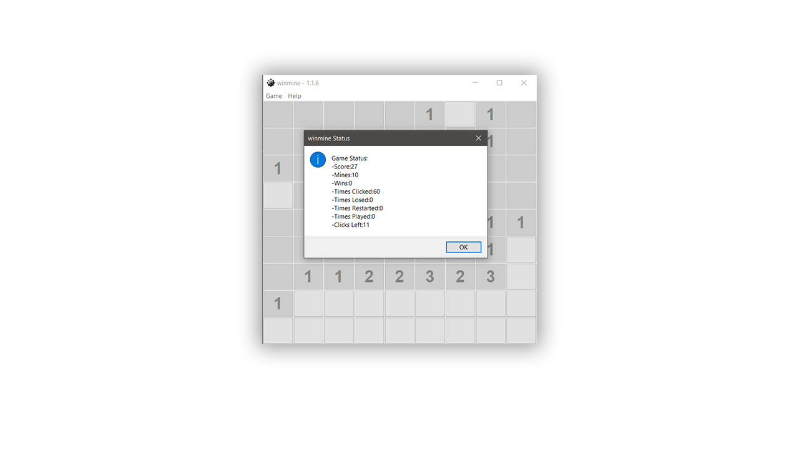

## winmine game c++
Version 2019 (OS Build 1.1.7)

<h2>A 9x9 game with user interface</h2>

<h2>10 mines that you will never avoid</h2>

<h2>All the game status you will need</h2>

 <h2> Info: </h2> 

- 
Name of the project: "winmine"

- 
Current version: 2019 (Build 1.1.7) 

- 
C++

- 
Created in Visual Studio 2019 

- 
Framework you may need: <a href="https://www.wxwidgets.org/">wxwidgets</a> 

- - 
!!The library of the wxwidgets does not include to the project.!! It will not run unless you add it!! May this will help you <a href="https://wiki.wxwidgets.org/Microsoft_Visual_C%2B%2B_Guide">setup wxwidgets to Visual Studio</a> 

- 
Working in Windows 7/8/8.1/10 

- 
Size of the project: 2.18 MB (2,289,149 bytes) 

<h2>license:</h2>

Author: Bill Chamalidis

Copyright (c). All rights Reserved

This program is free software: you can redistribute it and/or modify
    it under the terms of the <a href="https://www.gnu.org/licenses/gpl-3.0.en.html">GNU</a> General Public License as published by
    the Free Software Foundation, either version 3 of the License, or
    any later version.

